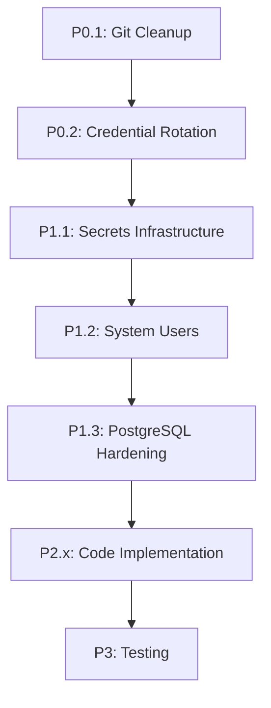

# SYNCTACLES CARE/Moltbot - MASTER SECURITY-FIRST PLAN

**Status:** 🔴 ACTIVE SECURITY INCIDENT
**Priority:** CRITICAL
**Created:** 2026-01-29
**Version:** 3.0 (Master Merged Plan)

---

## 🚨 EXECUTIVE SUMMARY

**SECURITY BREACH IDENTIFIED:**
- CREDENTIALS.md in Git history (5 commits since 2026-01-23)
- GitHub PAT token partially exposed
- Infrastructure details (IPs, SSH config) in public/private repo
- Bot tokens, database passwords in world-readable files
- No system-level isolation
- No secrets management infrastructure

**IMMEDIATE IMPACT:**
- Infrastructure fully mapped for attackers
- GitHub account potentially compromised
- All credentials must be considered compromised
- Complete credential rotation required

**ACTION REQUIRED:**
- Immediate Git history cleanup
- Full credential rotation
- Implementation of security-first architecture
- System-level isolation deployment

---

## 📊 MERGED FINDINGS

### CAI Analysis + Current Implementation Issues

| # | Issue | Source | Risk | Status |
|---|-------|--------|------|--------|
| 1 | CREDENTIALS.md in Git history | CAI + Verified | 🔴 CRITICAL | ⏳ In Progress |
| 2 | GitHub PAT in Git | Verified | 🔴 CRITICAL | ⏳ Pending |
| 3 | Bot tokens in plain text .env | CAI + My work | 🔴 CRITICAL | ✅ Permissions fixed |
| 4 | Database password plain text | CAI + My work | 🔴 CRITICAL | ✅ Permissions fixed |
| 5 | No system-level isolation | CAI | 🔴 CRITICAL | ⏳ Pending |
| 6 | No secrets management | CAI | 🔴 CRITICAL | ⏳ Pending |
| 7 | Port 3000 exposed | My work | 🔴 CRITICAL | ⏳ Pending |
| 8 | No API rate limiting | CAI | 🔴 CRITICAL | ⏳ Pending |
| 9 | No DB connection encryption | CAI + My work | 🟠 HIGH | ⏳ Pending |
| 10 | Insufficient input validation | CAI | 🟠 HIGH | ⏳ Pending |
| 11 | No audit logging | CAI | 🟠 HIGH | ⏳ Pending |
| 12 | Regex-only anonymization | CAI | 🟡 MEDIUM | ✅ Implemented |

---

# PHASE 0: CRITICAL INCIDENT RESPONSE (NOW - 2 hours)

## P0.1 Git History Cleanup 🔴

**Problem:** CREDENTIALS.md with infrastructure details in Git since commit `5eab175`

**Evidence:**
```
5eab175 docs: add CREDENTIALS.md for infrastructure access tracking
ab1cba1 docs: update CREDENTIALS.md - SSH deploy key now active
8cf6880 docs: update deployment workflow - manual only
a407d77 docs: comprehensive infrastructure documentation update
00c85ea docs: update infrastructure docs and add Moltbot project plan
```

**Contains:**
- GitHub PAT token (partial): `github_pat_11B5FV4LY0gCo19JUG8lQh_...`
- Server IPs: 46.62.212.227, 135.181.255.83, 135.181.201.253
- SSH configuration details
- Git remote configurations
- Infrastructure topology

**Actions:**
```bash
# 1. Remove from Git history (DESTRUCTIVE - requires force push)
cd /opt/github/synctacles-api

git filter-branch --force --index-filter \
  "git rm --cached --ignore-unmatch docs/CREDENTIALS.md" \
  --prune-empty --tag-name-filter cat -- --all

# 2. Clean refs
rm -rf .git/refs/original/
git reflog expire --expire=now --all
git gc --prune=now --aggressive

# 3. Update .gitignore
cat >> .gitignore << 'EOF'

# Security - NEVER commit these
docs/CREDENTIALS.md
docs/INFRASTRUCTURE.md
**/credentials.*
**/.env*
!**/.env.example
secrets/
*.pem
*.key
*.p12
EOF

# 4. Commit .gitignore
git add .gitignore
git commit -m "security: prevent credential files from being committed"

# 5. Force push (REQUIRES TEAM NOTIFICATION!)
# git push origin main --force  # ALLEEN NA APPROVAL!
```

**Verification:**
- [ ] `git log --all --full-history -- '*CREDENTIALS*'` returns nothing
- [ ] `.gitignore` contains all sensitive patterns
- [ ] Force push completed successfully
- [ ] All team members notified to re-clone

**Risk:** This is DESTRUCTIVE and requires force-push. Coordinate with team!

---

## P0.2 Credential Revocation & Rotation 🔴

### GitHub PAT Token
```bash
# Via GitHub Web UI:
# 1. Settings → Developer Settings → Personal Access Tokens
# 2. Find token starting with github_pat_11B5FV4LY0gCo19JUG8lQh_
# 3. Delete/Revoke token
# 4. Generate new token with minimal permissions
# 5. Update gh CLI config
```

### Telegram Bot Tokens (3x)
```bash
# Via @BotFather in Telegram:
# For each bot (Support, Monitor, Dev):
# 1. /mybots
# 2. Select bot
# 3. Bot Settings → Revoke Token
# 4. Generate new token
# 5. SAVE SECURELY (not in .env!)
```

### Database Password
```bash
# Generate new password
NEW_DB_PASS=$(openssl rand -hex 32)
echo "New DB Password: $NEW_DB_PASS" | gpg -e -r your-email@example.com > db_pass.gpg

# Update PostgreSQL
sudo -u postgres psql -c "ALTER USER care_dev WITH PASSWORD '$NEW_DB_PASS';"
```

### Admin API Key
```bash
NEW_ADMIN_KEY=$(openssl rand -hex 32)
# Store securely, update later
```

**Verification:**
- [ ] Old GitHub PAT revoked
- [ ] New GitHub PAT created and tested
- [ ] All 3 bot tokens revoked
- [ ] New bot tokens generated
- [ ] Database password changed
- [ ] Admin API key rotated
- [ ] All new credentials stored securely (NOT in .env!)

---

## P0.3 Emergency File Permissions 🔴

**Already Done:**
- ✅ `/opt/synctacles/config/.env.development` → 600
- ✅ `/tmp/support-bot.log` → 600
- ✅ Verified postgres/www-data cannot read

**Still TODO:**
```bash
# Fix old log
chmod 600 /tmp/support-bot.log 2>/dev/null || true

# Find and fix any other exposed secrets
sudo find /opt/synctacles -type f \( -name "*.env*" -o -name "*.key" -o -name "*password*" \) -perm /o+r -exec chmod 600 {} \;

# Verify
find /opt/synctacles -type f \( -name "*.env*" -o -name "*.key" \) -ls
```

**Verification:**
- [ ] No world-readable secret files
- [ ] All .env files have 600 permissions
- [ ] No keys/certs with wrong permissions

---

## P0.4 Network Exposure Fix 🔴

```bash
# Block exposed Next.js port
sudo ufw deny 3000/tcp
sudo ufw reload

# Verify
sudo ufw status | grep 3000
# Should show: 3000/tcp DENY Anywhere

# Test from external
curl -I http://$(hostname -I | awk '{print $1}'):3000 --max-time 5
# Should timeout or be refused
```

**Verification:**
- [ ] Port 3000 blocked
- [ ] External access test fails
- [ ] Application still works via nginx

---

# PHASE 1: SECURITY INFRASTRUCTURE (Day 1-2)

## P1.1 Secrets Management Infrastructure 🔴

### Directory Structure
```bash
#!/bin/bash
# setup-secrets-infrastructure.sh

set -e

echo "🔐 Setting up secrets infrastructure..."

# Create directory structure
sudo mkdir -p /etc/synctacles/secrets/{support,monitor,dev,shared}
sudo mkdir -p /etc/synctacles/config

# Set permissions
sudo chmod 700 /etc/synctacles/secrets
sudo chmod 700 /etc/synctacles/secrets/*
sudo chmod 755 /etc/synctacles/config

echo "✅ Directory structure created"

# Generate new credentials
echo "🔑 Generating new credentials..."

SUPPORT_DB_PASS=$(openssl rand -hex 32)
MONITOR_DB_PASS=$(openssl rand -hex 32)
DEV_DB_PASS=$(openssl rand -hex 32)
ADMIN_API_KEY=$(openssl rand -hex 32)
GITHUB_WEBHOOK_SECRET=$(openssl rand -hex 32)

# Create credential files (REPLACE <TOKEN> with actual values)
echo "Enter Telegram Bot Token for Support (from @BotFather): "
read -r SUPPORT_TOKEN
echo "$SUPPORT_TOKEN" | sudo tee /etc/synctacles/secrets/support/telegram_token >/dev/null

echo "Enter GROQ API Key: "
read -r GROQ_KEY
echo "$GROQ_KEY" | sudo tee /etc/synctacles/secrets/support/groq_api_key >/dev/null

# Write generated passwords
echo "$SUPPORT_DB_PASS" | sudo tee /etc/synctacles/secrets/support/db_password >/dev/null
echo "$MONITOR_DB_PASS" | sudo tee /etc/synctacles/secrets/monitor/db_password >/dev/null
echo "$DEV_DB_PASS" | sudo tee /etc/synctacles/secrets/dev/db_password >/dev/null
echo "$ADMIN_API_KEY" | sudo tee /etc/synctacles/secrets/shared/admin_api_key >/dev/null
echo "$GITHUB_WEBHOOK_SECRET" | sudo tee /etc/synctacles/secrets/dev/github_webhook_secret >/dev/null

# Set permissions (400 = read-only for root)
sudo chmod 400 /etc/synctacles/secrets/*/*

# Save generated credentials securely
cat > /tmp/generated-credentials.txt << EOF
=== GENERATED CREDENTIALS - SAVE SECURELY THEN DELETE THIS FILE ===

Support DB Password: $SUPPORT_DB_PASS
Monitor DB Password: $MONITOR_DB_PASS
Dev DB Password: $DEV_DB_PASS
Admin API Key: $ADMIN_API_KEY
GitHub Webhook Secret: $GITHUB_WEBHOOK_SECRET

=== UPDATE POSTGRESQL WITH THESE PASSWORDS ===

sudo -u postgres psql << PSQL
ALTER USER care_dev WITH PASSWORD '$SUPPORT_DB_PASS';
-- CREATE other users as needed
PSQL

=== AFTER SAVING, DELETE THIS FILE ===
rm /tmp/generated-credentials.txt
EOF

chmod 600 /tmp/generated-credentials.txt
echo ""
echo "✅ Secrets created in /etc/synctacles/secrets/"
echo "⚠️  Generated credentials saved to /tmp/generated-credentials.txt"
echo "⚠️  SAVE THESE SECURELY, then run: rm /tmp/generated-credentials.txt"
```

**Verification:**
- [ ] Directory structure exists
- [ ] All secrets have 400 permissions
- [ ] Only root can read secrets
- [ ] Generated credentials saved securely

---

## P1.2 System User Isolation 🔴

```bash
#!/bin/bash
# setup-moltbot-users.sh

set -e

echo "👤 Creating isolated system users..."

# Create system users (no login, no home)
for bot in support monitor dev; do
    sudo useradd -r -s /usr/sbin/nologin -M moltbot-${bot} 2>/dev/null || echo "User moltbot-${bot} already exists"
done

# Create directories
sudo mkdir -p /opt/moltbot-{support,monitor,dev,shared}
sudo mkdir -p /var/log/synctacles

# Set ownership
sudo chown -R moltbot-support:moltbot-support /opt/moltbot-support
sudo chown -R moltbot-monitor:moltbot-monitor /opt/moltbot-monitor
sudo chown -R moltbot-dev:moltbot-dev /opt/moltbot-dev
sudo chown -R root:root /opt/moltbot-shared

# Set permissions
sudo chmod 750 /opt/moltbot-{support,monitor,dev}
sudo chmod 755 /opt/moltbot-shared  # Read-only for bots
sudo chmod 750 /var/log/synctacles

# Create log files
for bot in support monitor dev; do
    sudo touch /var/log/synctacles/moltbot-${bot}.log
    sudo touch /var/log/synctacles/audit-${bot}.log
    sudo chown moltbot-${bot}:moltbot-${bot} /var/log/synctacles/*${bot}*
    sudo chmod 640 /var/log/synctacles/*${bot}*
done

echo "✅ System users created and isolated"
echo ""
echo "Users created:"
for bot in support monitor dev; do
    id moltbot-${bot}
done
```

**Verification:**
- [ ] Users exist: `id moltbot-support`
- [ ] No login shell: `grep moltbot /etc/passwd` shows `/usr/sbin/nologin`
- [ ] Directories have correct ownership
- [ ] Log files have correct permissions

---

## P1.3 PostgreSQL Hardening 🔴

### Enable SSL
```bash
# Generate self-signed cert
cd /etc/postgresql/16/main
sudo openssl req -new -x509 -days 365 -nodes -text \
  -out server.crt \
  -keyout server.key \
  -subj "/CN=localhost"

sudo chmod 600 server.key
sudo chown postgres:postgres server.key server.crt
```

### Configure PostgreSQL
```bash
# postgresql.conf
sudo tee -a /etc/postgresql/16/main/postgresql.conf << 'EOF'

# Security hardening
listen_addresses = 'localhost'
max_connections = 50
ssl = on
ssl_cert_file = '/etc/postgresql/16/main/server.crt'
ssl_key_file = '/etc/postgresql/16/main/server.key'
ssl_min_protocol_version = 'TLSv1.2'
password_encryption = scram-sha-256
log_connections = on
log_disconnections = on
EOF

# pg_hba.conf - SSL required
sudo tee /etc/postgresql/16/main/pg_hba.conf << 'EOF'
# TYPE  DATABASE        USER            ADDRESS         METHOD
local   all             postgres                        peer
hostssl synctacles_dev  care_dev        127.0.0.1/32    scram-sha-256
host    all             all             0.0.0.0/0       reject
EOF

# Restart PostgreSQL
sudo systemctl restart postgresql
```

### Create Separate Database Users
```sql
-- As postgres superuser
sudo -u postgres psql synctacles_dev << 'PSQL'

-- Create users with minimal permissions
CREATE USER mb_support WITH
    PASSWORD 'FROM_SECRETS_FILE'
    CONNECTION LIMIT 5
    NOSUPERUSER NOCREATEDB NOCREATEROLE;

CREATE USER mb_monitor WITH
    PASSWORD 'FROM_SECRETS_FILE'
    CONNECTION LIMIT 5
    NOSUPERUSER NOCREATEDB NOCREATEROLE;

CREATE USER mb_dev WITH
    PASSWORD 'FROM_SECRETS_FILE'
    CONNECTION LIMIT 5
    NOSUPERUSER NOCREATEDB NOCREATEROLE;

-- Revoke default permissions
REVOKE ALL ON DATABASE synctacles_dev FROM PUBLIC;
REVOKE ALL ON SCHEMA public FROM PUBLIC;

-- Grant connect
GRANT CONNECT ON DATABASE synctacles_dev TO mb_support, mb_monitor, mb_dev;
GRANT USAGE ON SCHEMA public TO mb_support, mb_monitor, mb_dev;

-- Support bot permissions
GRANT SELECT, INSERT, UPDATE ON telegram_users TO mb_support;
GRANT SELECT, INSERT, UPDATE ON support_logs TO mb_support;
GRANT SELECT, INSERT, UPDATE ON support_rate_limits TO mb_support;
GRANT SELECT, INSERT ON llm_usage TO mb_support;
GRANT SELECT ON care_installs, care_licenses TO mb_support;

-- Sequences
GRANT USAGE ON SEQUENCE telegram_users_id_seq TO mb_support;
GRANT USAGE ON SEQUENCE support_logs_id_seq TO mb_support;
GRANT USAGE ON SEQUENCE support_rate_limits_id_seq TO mb_support;
GRANT USAGE ON SEQUENCE llm_usage_id_seq TO mb_support;

-- Monitor bot permissions
GRANT SELECT, INSERT ON health_check_results TO mb_monitor;
GRANT SELECT, INSERT, UPDATE ON alerts TO mb_monitor;
GRANT SELECT, INSERT, UPDATE, DELETE ON alert_silences TO mb_monitor;
GRANT USAGE ON SEQUENCE health_check_results_id_seq TO mb_monitor;
GRANT USAGE ON SEQUENCE alerts_id_seq TO mb_monitor;
GRANT USAGE ON SEQUENCE alert_silences_id_seq TO mb_monitor;

-- Dev bot permissions
GRANT SELECT, INSERT, UPDATE ON deployments TO mb_dev;
GRANT USAGE ON SEQUENCE deployments_id_seq TO mb_dev;

PSQL
```

**Verification:**
- [ ] SSL enabled: `psql "sslmode=require host=localhost" -U care_dev`
- [ ] mb_support can connect
- [ ] mb_support CANNOT access health_check_results table
- [ ] mb_monitor CANNOT access support_logs table

---

# PHASE 2: CODE IMPLEMENTATION (Day 2-4)

## P2.1 Secrets Manager (Python)

See CAI document Section 2.5 for complete implementation of:
- `/opt/moltbot-shared/shared/secrets.py`
- SystemD credential loading
- Fallback for development
- Exception handling

## P2.2 Enhanced Input Validation

See CAI document Section 4.1 for:
- `/opt/moltbot-support/support_agent/services/file_validator.py`
- Magic byte detection
- Binary signature checking
- Filename sanitization
- Multiple validation layers

## P2.3 Multi-Level Rate Limiting

See CAI document Section 4.3 for:
- `/opt/moltbot-shared/shared/rate_limiter.py`
- Bot-level limits (protect GROQ quota)
- User-level limits (5/day free, unlimited pro)
- Per-endpoint limits

## P2.4 Audit Logging

See CAI document Section 5.1 for:
- `/opt/moltbot-shared/shared/audit.py`
- Structured JSON logging
- Security event types
- Secrets sanitization

## P2.5 Systemd Services

See CAI document Section 2.4 for:
- `/etc/systemd/system/moltbot-support.service`
- LoadCredential for secrets
- Hardening options (NoNewPrivileges, PrivateTmp, etc.)
- Resource limits

---

# PHASE 3: TESTING & VALIDATION (Day 5)

## Security Testing Checklist

```yaml
Git Security:
  [ ] CREDENTIALS.md not in history
  [ ] No secrets in any commits
  [ ] .gitignore prevents future leaks

Credentials:
  [ ] All old credentials revoked
  [ ] New credentials in /etc/synctacles/secrets/
  [ ] Permissions 400 on all secrets
  [ ] No credentials in logs or environment

System Isolation:
  [ ] Separate users per bot
  [ ] No login shells
  [ ] Correct directory ownership
  [ ] Log files isolated

Database:
  [ ] SSL required
  [ ] Separate users
  [ ] Minimal permissions per user
  [ ] Connection limits enforced

Application:
  [ ] Secrets loaded from systemd credentials
  [ ] Input validation on all user input
  [ ] Rate limiting on all endpoints
  [ ] Audit logging active
  [ ] No secrets in error messages

Network:
  [ ] Port 3000 blocked
  [ ] Firewall active
  [ ] Only necessary ports open
```

---

# IMPLEMENTATION PRIORITY

## Critical Path (Must Complete in Order)



## Time Estimates

| Phase | Duration | Parallel Work Possible |
|-------|----------|----------------------|
| P0: Critical Fixes | 2-4 hours | NO - Sequential |
| P1: Infrastructure | 1 day | Some parallel |
| P2: Code | 2-3 days | YES - High parallel |
| P3: Testing | 1 day | After code complete |
| **TOTAL** | **4-5 days** | With parallel work |

---

# GITHUB INTEGRATION

## Issue Creation
- Create GitHub issues for each major phase
- Track progress with GitHub Projects
- Link commits to issues

## PR Workflow
- All changes via feature branches
- Security review required for approval
- Test suite must pass

## Commit Convention
```
security(phase): brief description

Detailed explanation of security improvement

Implements: #<issue-number>
Security-Level: [CRITICAL|HIGH|MEDIUM|LOW]

Co-Authored-By: Claude Sonnet 4.5 <noreply@anthropic.com>
```

---

# EMERGENCY CONTACTS

- **Security Issue**: Immediately notify team lead
- **Credential Compromise**: Revoke immediately, notify all services
- **System Breach**: Take systems offline, investigate

---

**Document Status:** ACTIVE
**Last Updated:** 2026-01-29 10:50 UTC
**Next Review:** After P0 completion
**Approved By:** [Pending]

**This is the MASTER plan - all other security documents are superseded by this one.**
